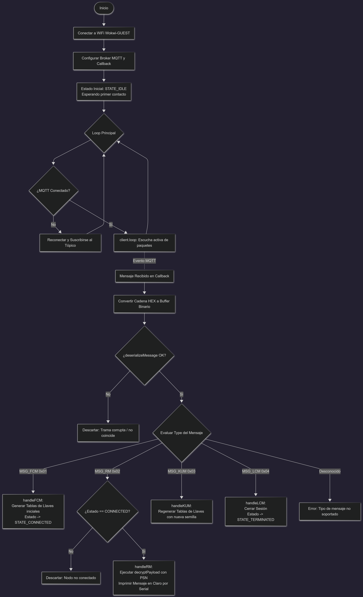

# Algoritmo de Cifrado Pólimorfico

## Descripción del Proyecto
Este repositorio contiene el código comentado y la documentación para un sistema de comunicación cifrada entre dos nodos (Emisor y Receptor) utilizando microcontroladores ESP32 en el simulador Wokwi. El proyecto implementa un motor criptográfico polimórfico y un protocolo de máquina de estados para la transmisión de datos a través de un broker MQTT público.

## Tecnologías utilizadas
* ESP32
* C/C++
* Wowki
* MQTT
* Criptografía
* Maquina de estados

## Equipo de Trabajo
* **Integrante 1:** Diego Jese Castellanos Valladares CV240473
* **Integrante 2:** Javier Stanley Escobar Portillo EP240471
* **Integrante 3:** Aaron Jaziel Pacas Ramos PR252213
* **Integrante 4:** Marco Alejandro Rivas Ochoa RO240441

**Universidad Don Bosco**  
**Materia:** Diseño de sistemas de seguridad en redes de datos  
**Docente:** Mg. Denis Alfredo Altuve Santamaria

## Simulaciones en Wokwi
A continuación se presentan los enlaces directos a las simulaciones duales en vivo:
* **Nodo A (Emisor):** https://wokwi.com/projects/474900900195298305
* **Nodo B (Receptor):** https://wokwi.com/projects/474900922194428929

## Estructura del Repositorio
* `/Nodo_A_Emisor`: Contiene `sketch.ino`, `crypto.h` y `protocol.h` del nodo emisor.
* `/Nodo_B_Receptor`: Contiene `sketch.ino`, `crypto.h` y `protocol.h` del nodo receptor.
* `/Documentacion`: Contiene los diagramas de flujo y el documento final de investigación.

## Instrucciones de Uso
1. Abrir los enlaces de Wokwi correspondientes al Nodo A y Nodo B
2. Iniciar la simulación en ambos proyectos.
3. Observar la consola serial: el emisor mostrará el envío de datos cifrados, mientras que el receptor mostrará el descifrado en tiempo real.

## Diagramas de Flujo
*(Nota: Para que estas imágenes se vean, debes subir tus diagramas a la carpeta Documentacion con estos nombres exactos, o cambiar los nombres aquí)*

